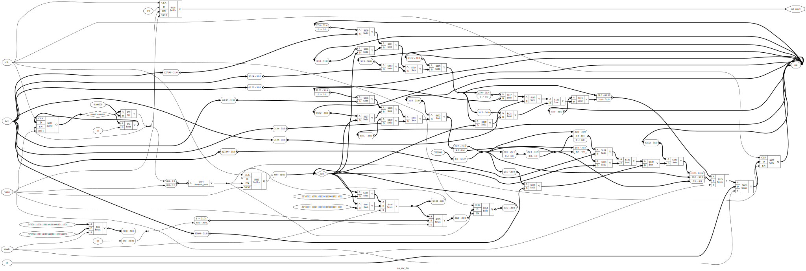

# VerilogTea
This is a Verilog implementation of the Tiny Encryption Algorithm.

- `ref.c` contains a reference implementation adapted from the TEA paper, and
  some discussion on endianness issues.
- `tea.v` contains the Verilog implementation
- `test.v` - a Verilog testbench

# Simulation

To run the testbench using Icarus Verilog, run:
```
iverilog tea.v test.v -o tea && vvp tea
```

The TEA paper does not give any test vectors, so we use the test vectors used
in Linux (search for `tea_tv_template`):

https://raw.githubusercontent.com/torvalds/linux/93e220a62da36f766b3188e76e234607e41488f9/crypto/testmgr.h

TODO:

- reduce the circuit size by saving intermediate rounds in a reusable register.
- experiment with pipelining?
- timing analysis

