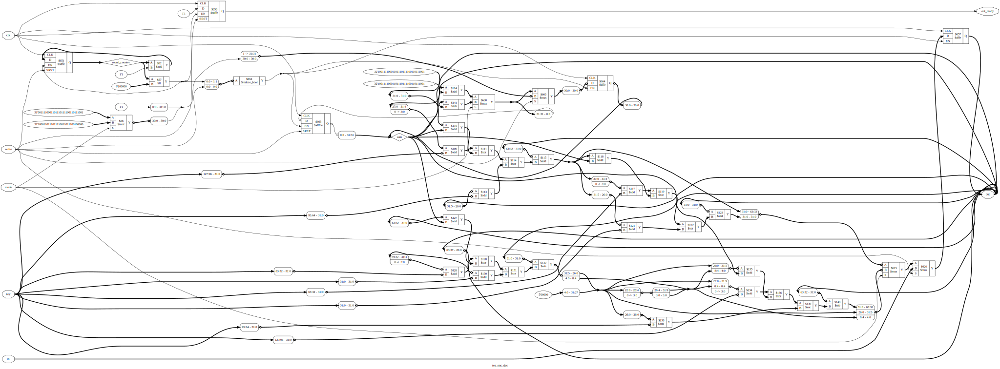

# VerilogTea
This is a Verilog implementation of the Tiny Encryption Algorithm.

- `ref.c` contains a reference implementation adapted from the TEA paper, and
  some discussion on endianness issues.
- `tea.v` contains the Verilog implementation
- `test.v` - a Verilog testbench

# Simulation

To run the testbench using Icarus Verilog, run:
```
iverilog tea.v test.v -o tea && vvp tea
```

The TEA paper does not give any test vectors, so we use the test vectors used
in Linux (search for `tea_tv_template`):

https://raw.githubusercontent.com/torvalds/linux/93e220a62da36f766b3188e76e234607e41488f9/crypto/testmgr.h

# Synthesis with Yosys

The module can be synthetized with [Yosys](https://github.com/YosysHQ/yosys) for the ICE40 family by running:

```
yosys synth.ys
```

This produces a verilog file `tea_synth.v` which implements this module using
the primitives available in ICE40. This also saves the .json file in a which can be used with a place-and-route tool like nextpnr.

You can even run the testbench with the synthesized version by running:

```
test_synth.sh
```

## Cool diagram

The diagram below shows the result of "high level" synthesis - replacing
procedural blocks by multiplexers and applying some basic optimizations.
However, unlike in the case of full synthesis, the translation of high-level
blocks like adders to logic gate level is not performed. This makes the picture
readable while still giving an overview of how the code will be synthesized.
Also, the `swapbytes` parameter is set to 0 to simplify the diagram.

To re-generate the diagram, run `yosys show.ys`.


